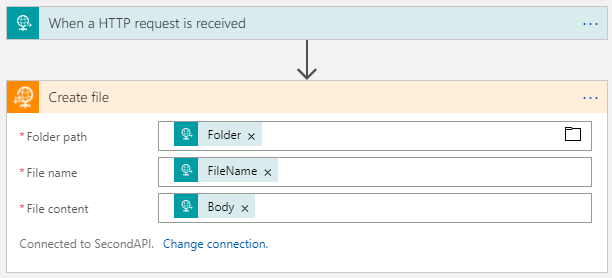
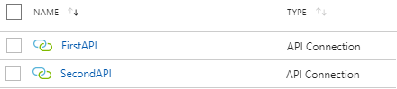
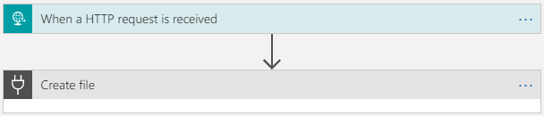

## Logic Apps: Dynamically defining the API Connection at runtime

> Creating generic solutions do not only reduce the amount of code that has to be written, or maintained, but 
also extend the speed at which new interfaces can be introduced into the same environment. 
So why not do the same with Logic Apps, by dynamically defining the API Connection that is to be used.

---

People who have a background in BizTalk development, are aware of the fact that the support for dynamic send ports allow you to quickly add additional flows to the same interface, by defining the correct endpoint based on a specific property/value in the message. This is also allowing you to build generic solutions, capable of sending data to multiple parties.
 
As the number of integration-projects that are moving to Logic Apps is steadily growing, so will be the need to make use of generic interfaces that are able to support the sending of data to multiple parties/locations. While there is no problem in doing so, if you simply want to specify the file path on a FTP-server, as this can be achieved by assigning a property from one of the previously executed actions, this becomes an entirely different story if the data should be sent to a completely different FTP-server. Unfortunately, at the time of writing, there is no such thing as a dynamic connector and no way to dynamically specify the used API Connection from within the Logic App-designer. But we are not completely out of luck, since we have access to the code/JSON and are capable of using ARM to modify/deploy a Logic App, containing multiple friendly-named connectors that can be assigned on-the-fly.
 
**Keep in mind though**: when using dynamic API Connections, you will no longer be able to modify the Logic App in the designer mode. So better make sure all of the actions you wanted to have, are added before implementing this 'dynamic connector'-solution.

### Have a look at the JSON of a simple, static Logic App
Let's have a look at the different sections that should be present in the ARM to deploy multiple API Connections or Logic Apps:
- _Parameters_:  
    Used to define variables that can be used throughout the ARM-template
- _Resources_:  
    The actual resources that are going to be deployed, in our case this will be the API Connections and the Logic App.
 
Below is a section from an ARM-template that can be used to create a single API Connection, that is being assigned a friendly name 'FirstAPI', instead of an autogenerated one, such as 'ftp', 'ftp-1', 'ftp-2', …

```json
{
    "$schema": "https://schema.management.azure.com/schemas/2015-01-01/deploymentTemplate.json#",
    "contentVersion": "1.0.0.0",
    "parameters": {
        "connections_FirstAPI_name": {
            "defaultValue": "FirstAPI",
            "type": "String"
        }
    },
    "variables": {},
    "resources": [
        {
            "comments": "Generalized from resource: '/subscriptions/<subscriptionId>/resourceGroups/LogicApps_DynAPIConn/providers/Microsoft.Web/connections/FirstAPI'.",
            "type": "Microsoft.Web/connections",
            "name": "[parameters('connections_FirstAPI_name')]",
            "apiVersion": "2016-06-01",
            "location": "North Europe",
            "scale": null,
            "properties": {
                "displayName": "[parameters('connections_FirstAPI_name')]",
                "customParameterValues": {},
                "api": {
                    "id": "[concat('/subscriptions/', subscription().subscriptionId, '/providers/Microsoft.Web/locations/', resourceGroup().location, '/managedApis/ftp')]"
                }
            },
            "dependsOn": []
        }
    ]
}
```

The above template would result in the creation of a single API Connection. As you have probably noticed, none of the connection specific details are present in the ARM-template, meaning you will not be able to use this connection as-is. It still need to be configured through the portal.


When moving on and more specifically looking at the JSON used to build up the Logic App, we notice the following sections:
- _$connections_:  
    An array of connections referring to an actual API Connection that has been created in the resource group.
- _definition_:  
    All of the actions present in the Logic App.
 
The below example shows the JSON requires to create a Logic App that is being triggered by an HTTP POST and sends the data to an FTP-location.  

As you can see, this contains of a single reference to the existing connection, of which the template can be found above + the definition of the Logic App itself.

```json
{
    "$connections": {
        "value": {
            "FirstAPI": {
                "connectionId": "/subscriptions/<subscriptionId>/resourceGroups/LogicApps_DynAPIConn/providers/Microsoft.Web/connections/FirstAPI",
                "connectionName": "FirstAPI",
                "id": "/subscriptions/<subscriptionId>/providers/Microsoft.Web/locations/northeurope/managedApis/ftp"
            }
        }
    },
    "definition": {
        "$schema": "https://schema.management.azure.com/providers/Microsoft.Logic/schemas/2016-06-01/workflowdefinition.json#",
        "actions": {
            "Create_file": {
                "inputs": {
                    "body": "@triggerBody()",
                    "host": {
                        "connection": {
                            "name": "@parameters('$connections')['FirstAPI']['connectionId']"
                        }
                    },
                    "method": "post",
                    "path": "/datasets/default/files",
                    "queries": {
                        "folderPath": "@{triggerOutputs()['headers']['Folder']}",
                        "name": "@{triggerOutputs()['headers']['FileName']}"
                    }
                },
                "runAfter": {},
                "runtimeConfiguration": {
                    "contentTransfer": {
                        "transferMode": "Chunked"
                    }
                },
                "type": "ApiConnection"
            }
        },
        "contentVersion": "1.0.0.0",
        "outputs": {},
        "parameters": {
            "$connections": {
                "defaultValue": {},
                "type": "Object"
            }
        },
        "triggers": {
            "manual": {
                "inputs": {
                    "schema": {}
                },
                "kind": "Http",
                "type": "Request"
            }
        }
    }
}

```

Of course, this is just a simple Logic App that is using a static API Connection, to send the data to a specific folder based on the HTTP-headers of the inbound HTTP-request. Nothing special or generic about this one, obviously.



### Transforming the Logic App to use dynamic connections.
 
If we want to modify the above Logic App in order to make sure it is using a dynamic API Connection, there are a couple additions that will be required, both by executing an ARM-template to add an additional connection, as well as updating the Logic App itself, to make it aware of the new connection.  
 
In case a second API Connection should be added, this can be done by simply executing the same JSON as mentioned above, this time specifying the desired 'friendly' name, but in case you would want to deploy these API Connections simultaneously the below JSON consists of the definition of both connections.

```json
{
    "$schema": "https://schema.management.azure.com/schemas/2015-01-01/deploymentTemplate.json#",
    "contentVersion": "1.0.0.0",
    "parameters": {
        "connections_FirstAPI_name": {
            "defaultValue": "FirstAPI",
            "type": "String"
        },
        "connections_SecondAPI_name": {
            "defaultValue": "SecondAPI",
            "type": "String"
        }
    },
    "variables": {},
    "resources": [
        {
            "comments": "Generalized from resource: '/subscriptions/<subscriptionId>/resourceGroups/LogicApps_DynAPIConn/providers/Microsoft.Web/connections/FirstAPI'.",
            "type": "Microsoft.Web/connections",
            "name": "[parameters('connections_FirstAPI_name')]",
            "apiVersion": "2016-06-01",
            "location": "North Europe",
            "scale": null,
            "properties": {
                "displayName": "[parameters('connections_FirstAPI_name')]",
                "customParameterValues": {},
                "api": {
                    "id": "[concat('/subscriptions/', subscription().subscriptionId, '/providers/Microsoft.Web/locations/', resourceGroup().location, '/managedApis/ftp')]"
                }
            },
            "dependsOn": []
        },
        {
            "comments": "Generalized from resource: '/subscriptions/<subscriptionId>/resourceGroups/LogicApps_DynAPIConn/providers/Microsoft.Web/connections/SecondAPI'.",
            "type": "Microsoft.Web/connections",
            "name": "[parameters('connections_SecondAPI_name')]",
            "apiVersion": "2016-06-01",
            "location": "North Europe",
            "scale": null,
            "properties": {
                "displayName": "[parameters('connections_SecondAPI_name')]",
                "customParameterValues": {},
                "api": {
                    "id": "[concat('/subscriptions/', subscription().subscriptionId, '/providers/Microsoft.Web/locations/', resourceGroup().location, '/managedApis/ftp')]"
                }
            },
            "dependsOn": []
        }
    ]
}
```

If the above ARM-template has been executed successfully, this would result into 2 API Connections, both having a friendly/clear name.



Looking back to the JSON-definition of the Logic App, you should notice the definition of the connection that has been added at the top of the script, which was referring to the 'FirstAPI'-connection. Since a second API Connection has been created, the Logic app itself should be updated as well, in order to make sure this additional connection can be used.  

Once this is the case, the implementation of the Logic App itself should be modified to call the correct API Connection, which in this case, will be done by specifying the name of the API Connection in the HTTP-request headers.

```json
{
    "$connections": {
        "value": {
            "FirstAPI": {
                "connectionId": "/subscriptions/<subscriptionId>/resourceGroups/LogicApps_APIConn/providers/Microsoft.Web/connections/FirstAPI",
                "connectionName": "FirstAPI",
                "id": "/subscriptions/<subscriptionId>/providers/Microsoft.Web/locations/northeurope/managedApis/ftp"
            },
            "SecondAPI": {
                "connectionId": "/subscriptions/<subscriptionId>/resourceGroups/LogicApps_APIConn/providers/Microsoft.Web/connections/SecondAPI",
                "connectionName": "SecondAPI",
                "id": "/subscriptions/<subscriptionId>/providers/Microsoft.Web/locations/northeurope/managedApis/ftp"
            }
        }
    },
    "definition": {
        "$schema": "https://schema.management.azure.com/providers/Microsoft.Logic/schemas/2016-06-01/workflowdefinition.json#",
        "actions": {
            "Create_file": {
                "inputs": {
                    "body": "@triggerBody()",
                    "host": {
                        "connection": {
                            "name": "@parameters('$connections')[triggerOutputs()['headers']['APIConnectionName']]['connectionId']"
                        }
                    },
                    "method": "post",
                    "path": "/datasets/default/files",
                    "queries": {
                        "folderPath": "@{triggerOutputs()['headers']['Folder']}",
                        "name": "@{triggerOutputs()['headers']['FileName']}"
                    }
                },
                "runAfter": {},
                "runtimeConfiguration": {
                    "contentTransfer": {
                        "transferMode": "Chunked"
                    }
                },
                "type": "ApiConnection"
            }
        },
        "contentVersion": "1.0.0.0",
        "outputs": {},
        "parameters": {
            "$connections": {
                "defaultValue": {},
                "type": "Object"
            }
        },
        "triggers": {
            "manual": {
                "inputs": {
                    "schema": {}
                },
                "kind": "Http",
                "type": "Request"
            }
        }
    }
}
```
Notice how the above ARM-template differs from the earlier template as it contains the additions/changes that have been made based on the original JSON to add a reference to the second connection and the change that is actually allowing you to dynamically set the API Connection.
 
As mentioned before, after updating this Logic App, this way, you will no longer be able to save any changes in the designer view, because this will be what you'll get see. Notice how the orange icon on the 'Create File'-action turned into a black 'unknown connector'-icon and is no longer able to show any of the properties.



If we were to send a HTTP POST-request to this Logic App, it should contain these HTTP headers, in order for it to be able to send the data towards the correct FTP-server/folder.


Even though this is working as it should, it's far from being perfect, as the sending application should specify all information about the FTP-server where the data needs to end up and specify the exact name of the API Connection within our Azure Resource Group.   
While this ensures the Logic app to be generic, this does mean that the connection-information about the destination endpoint will be spread across Azure and the calling application. 

What if you could save all of the connection info within the Azure Resource Group? This would mean the only requirement for the calling app would be to know the name of the destination party, which can even be different from the actual 'API Connection'-name.

### Further transformation in order to obtain a generic solution.

Of course, the API connection itself is already containing the credentials and server-name _(in case of FTP)_, but the other connection-details, such as folder/filename-structure/… cannot be defined in this location. To prevent the calling application from having to provide, or even know, all of this information, you have the possibility to make use of the metadata-properties of a 'partner' inside an Integration Account.  
_An alternative could be to store this information in a storage-account, in order to avoid the costs of an Integration Account._

This way, the only value that has to be provided by the sending application is the name of the destination-party, which can match the name of the partner. This way, the metadata-properties can even be used to define the name of the API Connection that is to be used for that specific destination.


By using the 'Integration Account Artifact Lookup'-action, you can retrieve all of the information which has been stored in the Integration Account.


As mentioned before, once assigning the API Connection dynamically, the designer is no longer working as it should, meaning any further adaptations should be done using the code view. The above modification, using the IA-lookup, will result into the below JSON and ensures the LA is completely generic.

```json
{
    "$connections": {
        "value": {
            "FirstAPI": {
                "connectionId": "/subscriptions/<subscriptionId>/resourceGroups/LogicApps_APIConn_ARM/providers/Microsoft.Web/connections/FirstAPI",
                "connectionName": "FirstAPI",
                "id": "/subscriptions/<subscriptionId>/providers/Microsoft.Web/locations/southcentralus/managedApis/ftp"
            },
            "SecondAPI": {
                "connectionId": "/subscriptions/<subscriptionId>/resourceGroups/LogicApps_APIConn_ARM/providers/Microsoft.Web/connections/SecondAPI",
                "connectionName": "SecondAPI",
                "id": "/subscriptions/<subscriptionId>/providers/Microsoft.Web/locations/southcentralus/managedApis/ftp"
            }
        }
    },
    "definition": {
        "$schema": "https://schema.management.azure.com/providers/Microsoft.Logic/schemas/2016-06-01/workflowdefinition.json#",
        "actions": {
            "Create_file": {
                "inputs": {
                    "body": "@outputs('Integration_Account_Artifact_Lookup')['properties']['metadata']['ConnectionName']",
                    "host": {
                        "connection": {
                            "name": "@parameters('$connections')[outputs('Integration_Account_Artifact_Lookup')['properties']['metadata']['ConnectionName']]['connectionId']"
                        }
                    },
                    "method": "post",
                    "path": "/datasets/default/files",
                    "queries": {
                        "folderPath": "@outputs('Integration_Account_Artifact_Lookup')['properties']['metadata']['FtpFolder']",
                        "name": "@triggerOutputs()['headers']['FileName']"
                    }
                },
                "runAfter": {
                    "Integration_Account_Artifact_Lookup": [
                        "Succeeded"
                    ]
                },
                "runtimeConfiguration": {
                    "contentTransfer": {
                        "transferMode": "Chunked"
                    }
                },
                "type": "ApiConnection"
            },
            "Integration_Account_Artifact_Lookup": {
                "inputs": {
                    "artifactName": "@triggerOutputs()['headers']['Partner']",
                    "artifactType": "Partner"
                },
                "runAfter": {},
                "type": "IntegrationAccountArtifactLookup"
            }
        },
        "contentVersion": "1.0.0.0",
        "outputs": {},
        "parameters": {
            "$connections": {
                "defaultValue": {},
                "type": "Object"
            }
        },
        "triggers": {
            "manual": {
                "inputs": {
                    "method": "POST",
                    "schema": {}
                },
                "kind": "Http",
                "type": "Request"
            }
        }
    }
}
```

### Conclusion
Logic Apps offers you the capability of creating a generic Logic App, which dynamically defines the API Connection that is to be used and retrieves all connection-specific information from the Integration Account, using the partner-metadata.  

The downside of this way of working, is the inability of using the LA Designer, once it has been configured to use dynamic connections. Forcing you to make any future change in the Code view, which offers quite some complexity if you want to add new actions.  
Additionally, the use of an Integration Account adds quite some costs, especially if this only being used for this purpose, so as mentioned you might want to take a look at using a storage account or even KeyVault for this. 


---

[&larr; back](index.md)
