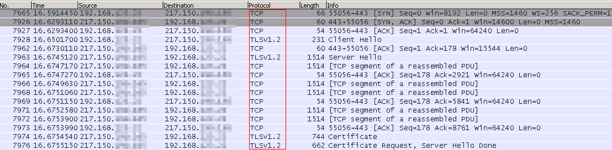
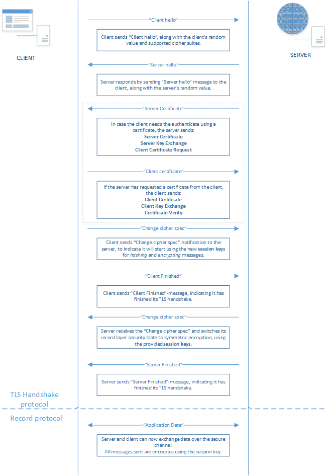
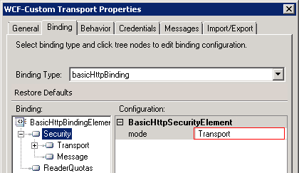
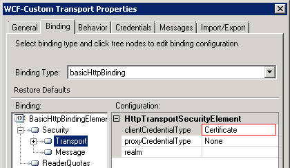
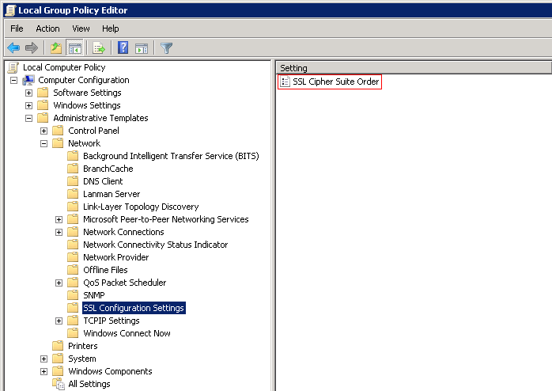
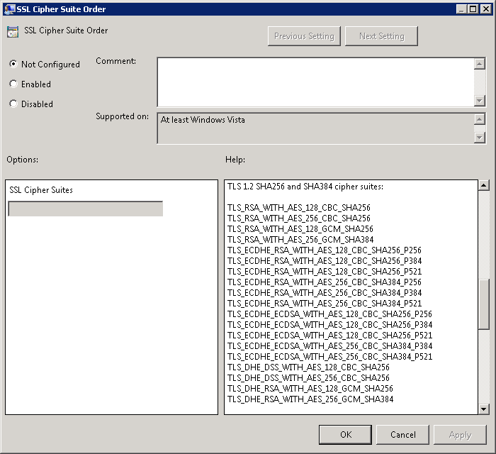
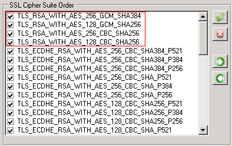
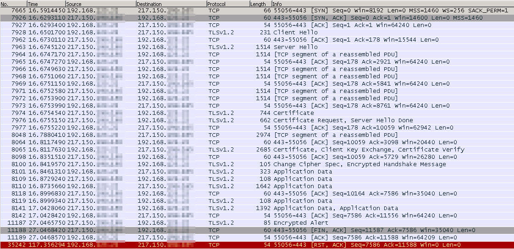
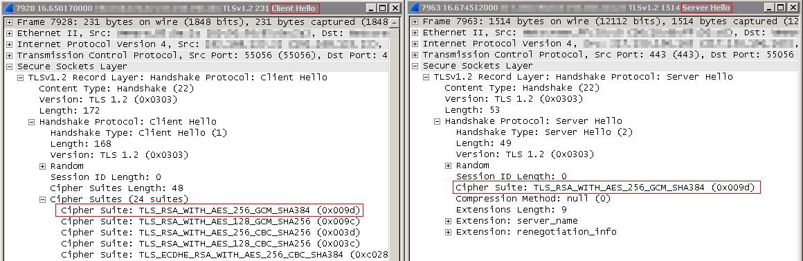

## BizTalk Server 2010 and support for TLS 1.2

> BizTalk Server 2010 does not support the use of TLS1.2. Learn how there is a way to get this up and running anyway. 

---

Setting up the connection from a BizTalk Server 2010 send port towards a service with transport-security (https) using certificates, is not always straight-forward. But as long as you’re attempting to use SSL3.0 or TLS1.0, it should, in most cases, not be rocket-science.

However, when attempting to address a service, utilizing the security protocol TLS v1.2, you might get the error as shown below.

```
The adapter failed to transmit message going to send port ” Sp_SendToService_WCF-Custom” with URL ” https://some-service/Action”.  
It will be retransmitted after the retry interval specified for this Send Port. Details:”System.ServiceModel.Security.MessageSecurityException: 
The HTTP request was forbidden with client authentication scheme ‘Anonymous’. —> System.Net.WebException: The remote server returned an error: (403) Forbidden. 
  at System.Net.HttpWebRequest.EndGetResponse(IAsyncResult asyncResult) 
   at System.ServiceModel.Channels.HttpChannelFactory`1.HttpRequestChannel.HttpChannelAsyncRequest.CompleteGetResponse(IAsyncResult result) 
   — End of inner exception stack trace —

Server stack trace: 
   at System.Runtime.AsyncResult.End[TAsyncResult](IAsyncResult result) 
   at System.ServiceModel.Channels.ServiceChannel.SendAsyncResult.End(SendAsyncResult result) 
   at System.ServiceModel.Channels.ServiceChannel.EndCall(String action, Object[] outs, IAsyncResult result) 
   at System.ServiceModel.Channels.ServiceChannel.EndRequest(IAsyncResult result)

Exception rethrown at [0]: 
   at System.Runtime.Remoting.Proxies.RealProxy.HandleReturnMessage(IMessage reqMsg, IMessage retMsg) 
   at System.Runtime.Remoting.Proxies.RealProxy.PrivateInvoke(MessageData& msgData, Int32 type) 
   at System.ServiceModel.Channels.IRequestChannel.EndRequest(IAsyncResult result) 
   at Microsoft.BizTalk.Adapter.Wcf.Runtime.WcfClient`2.RequestCallback(IAsyncResult result)”.
```

The cause to this issue is the fact that .NET 4.0, which is what BizTalk Server 2010 on Windows Server 2008 (R2), will be running on, does not support anything other than SSL v3.0 and TLS v1.0.

.NET Framework 4.5 however, does support the use of TLS v1.1 and TLS v1.2, therefore is seems obvious that in order for this connection to work, the installation of this version of the .NET framework should be required.

### Install .NET v4.5.2

In this case, we chose to install the .NET Framework v4.5.2, just to get all of the latest bits and bobs within the .NET Framework v4.5.  

The installer of this version of the framework can, of course, be downloaded from the Microsoft-site:  

https://www.microsoft.com/en-us/download/details.aspx?id=42642

The process of installation is very straight-forward, just follow the wizard right up to the point a server-reboot is requested.  

### Update registry-settings.
Since the installation of the .NET Framework 4.5.2 by itself is not enough to make sure that BizTalk is actually able to use TLS1.2, you need to make some changes in the registry.  

Create the following keys and matching DWORDs.

```
[HKEY_LOCAL_MACHINESYSTEMCurrentControlSetControlSecurityProvidersSCHANNELProtocolsTLS 1.2Client]
   “DisabledByDefault”=dword:00000000
   “Enabled”=dword:00000001 

[HKEY_LOCAL_MACHINESYSTEMCurrentControlSetControlSecurityProvidersSCHANNELProtocolsTLS 1.2Server]
   “DisabledByDefault”=dword:00000000
   “Enabled”=dword:00000001
```

Now, set the .NET Framework 4.0 to use the latest version of the SecurityProtocol, by creating the DWORDs mentioned below, for both 32- and 64-bit hosts.  

```
[HKEY_LOCAL_MACHINESOFTWAREMicrosoft.NETFrameworkv4.0.30319]
   “SchUseStrongCrypto”=dword:00000001

[HKEY_LOCAL_MACHINESOFTWAREWow6432NodeMicrosoft.NETFrameworkv4.0.30319]
   “SchUseStrongCrypto”=dword:00000001
```

**Beware!** While this will enable BizTalk to use TLS1.2, this will default the SecurityProtocol to this version. In order to use a different version, a custom endpoint behavior would be required.

Once all of the registry-keys have been created/modified, reboot the server in order for the changes to come into effect.

### Ready.. set.. (no) go!
Once all of the registry-settings are modified and the server has been rebooted, the next step is to test the connection. In my case this meant triggering the BizTalk flow in order to send a request towards the service.  

Unfortunately, the send port got the ‘Transmission Failure’-event type, which clearly meant something is still off. Firstly I wanted to make sure that BizTalk was actually attempting to set up the connection using TLS1.2.  

In order to make sure what protocol was being used, I opted to go for Wireshark. Therefore, the next step was to start the Wireshark-trace and trigger the BizTalk flow once more.  

As can be seen in the screenshot below, BizTalk Server will actually be using security protocol TLS1.2 at this point, thanks to all of the changes to the registry, as mentioned before.  



Once you are sure BizTalk Server 2010 is using TLS 1.2 – even if you are still getting an exception – you no longer need to think about this part of the setup. The next step, however, is to troubleshoot the cause of the error.  

Perhaps before diving into the exception handling, it might come in handy to get a little overview of the TLS handshake protocol that is being used to set up the secure channel in between the client and server. Therefore a schema can be found below, which explains what steps are being performed by both client and server.




### Running into a ‘Could not create SSL/TLS secure channel’-exception
Rest assured, you are not the only one who is running into a few hiccups while setting up a communication-channel based on TLS1.2 when utilizing BizTalk Server. One of the possible errors you might be getting when actually testing the connection is the one you can read below, which is not quite as elaborate as it could be, or at least not as elaborate as I would have wanted it to be:

```
The adapter failed to transmit message going to send port “Sp_SendToService_WCF-Custom” with URL “https://some-service/Action”. 
It will be retransmitted after the retry interval specified for this Send Port. Details:”System.ServiceModel.Security.SecurityNegotiationException: 
Could not establish secure channel for SSL/TLS with authority ‘some-service’. —> System.Net.WebException: The request was aborted: Could not create SSL/TLS secure channel.
   at System.Net.HttpWebRequest.EndGetResponse(IAsyncResult asyncResult)
   at System.ServiceModel.Channels.HttpChannelFactory`1.HttpRequestChannel.HttpChannelAsyncRequest.CompleteGetResponse(IAsyncResult result)
   — End of inner exception stack trace —

Server stack trace:
   at System.Runtime.AsyncResult.End[TAsyncResult](IAsyncResult result)
   at System.ServiceModel.Channels.ServiceChannel.SendAsyncResult.End(SendAsyncResult result)
   at System.ServiceModel.Channels.ServiceChannel.EndCall(String action, Object[] outs, IAsyncResult result)
   at System.ServiceModel.Channels.ServiceChannel.EndRequest(IAsyncResult result)

Exception rethrown at [0]:
   at System.Runtime.Remoting.Proxies.RealProxy.HandleReturnMessage(IMessage reqMsg, IMessage retMsg)
   at System.Runtime.Remoting.Proxies.RealProxy.PrivateInvoke(MessageData& msgData, Int32 type)
   at System.ServiceModel.Channels.IRequestChannel.EndRequest(IAsyncResult result)
   at Microsoft.BizTalk.Adapter.Wcf.Runtime.WcfClient`2.RequestCallback(IAsyncResult result)”.
```

Okay, this is indicating something went wrong during the actual creation of the communication channel in between BizTalk Server and the target web-service. But as to what might be the cause to this error, isn’t quite as clear as you would want it to be. But hey, what developer doesn’t like a good challenge, right?

Some of the possible solutions you might find while googling this problem are listed below, just in case you might be in one of these situations:

_(FYI: the last one in the list, solved the problem in our case.)_

### Your certificates are in the wrong store
Make sure that the root-certificate is in the actual ‘Trusted Root Certification Authorities’-store and the certificate to be used for this communication is in the ‘Personal’-store.

One possible way to check if these have been imported correctly is to open up the properties of the signing certificate (the one with the private key, that should be in the ‘Personal’-store) and verify if there is not an error-symbol showing as in the screenshot below. If this seems OK, good chances are, the certificates are in the correct store.


### Check the send port configuration
While you might be thinking about the more advanced stuff, it is easy to overlook the obvious cases. Just make sure that within the configuration of the WCF-Custom send port, you have set the Security-mode to ‘_Transport_’ and the ‘_Transport/ClientCredentialType_’ to ‘_Certificate_’. 


 


### Explicitly setting the SecurityProtocol to be used, via custom endpoint behavior
One of the other possible solutions might be to explicitly set the SecurityProtocol to be used for this connection, by writing a custom endpoint behavior which does it for you.  

While this shouldn’t be required, since the aforementioned registry-settings should’ve made sure that TLS1.2 is being used, the section below should be added into the custom endpoint behavior.  

**Note:** this could also be used in case of using a different SecurityProtocol for other send ports.

```cs
public void ApplyClientBehavior(ServiceEndpoint endpoint, System.ServiceModel.Dispatcher.ClientRuntime clientRuntime)
{
	System.Net.ServicePointManager.SecurityProtocol = System.Net.SecurityProtocolType.Tls12;
}
```

A nice recap on how to create such a custom endpoint behavior, can be found in [this post](https://www.codit.eu/blog/using-windows-credentials-in-wcf-custom-adapter/), by Mathieu Vermote, while the several ways of registering such a behavior can be found in [Toon Vanhoutte](https://github.com/ToonVanhoutte)’s post over [here](https://www.codit.eu/blog/how-to-register-wcf-extensions-in-biztalk/).

### Check the SSL Cipher Suites and their order.
Now this is the one that did the trick for me. While this might not be the most obvious setting one might be thinking of, this does play an important role, while performing the handshake-process during the creation of the channel in between BizTalk Server and the actual service.  

While using Wireshark to troubleshoot the connectivity issues, we noticed that the actual negotiation in between client and server went OK and BizTalk Server was actually using TLS 1.2. However, when the actual data-transmission was supposed to start, the handshake was failing and an ‘Encrypted Alert’ was returned by the server, which was followed by the closing down of the connection.  

 

When drilling down into the trace, you will notice that the client, BizTalk in our case, is sending an entire list of possible cipher suites to be used for this connection, while the server will respond by choosing one of these versions. In our case, the server just picked the first one, and responded using this version. 

 

After troubleshooting for some time, we got informed by the host of this service, that it was only supporting these SSL Cipher Suites:

- TLS_RSA_WITH_AES_256_GCM_SHA384
- TLS_RSA_WITH_AES_128_GCM_SHA256
- TLS_RSA_WITH_AES_256_CBC_SHA256
- TLS_RSA_WITH_AES_128_CBC_SHA256

Comparing these values, with those we got returned to us by the server, as can be seen in Wireshark, clearly indicated this might be the root-cause to our problem.

Since we could see, based on the complete Wireshark-trace that the aforementioned, required cipher suites were available, we had to check whether the order of these cipher suites could be changed. The same check can be performed to add additional cipher suites to the list, in case the required one is missing.

In order to check this order, 2 approaches can be used:

#### Local Group Policy Editor  

This editor can be opened by typing “_gpedit.msc_” in de “_Run_”-dialogue. Once the editor has popped up, navigate down towards the “_SSL Configuration Settings_”, to find the “_SSL Cipher Suite Order_”-property.

 

Opening up the information of this property, shows you a little “_Help_”-section indicating that if no specific order has been specified, the default order will be used.

However, when looking at this order, those required by the service, in this case, were actually at the top of list. This indicates that this property is in fact not showing the actual order of the SSL Cipher Suites.



#### Third-party tool: IISCrypto40

As the order of the SSL Cipher Suites did not seem to be correct, based on what we got to see in Wireshark, the third party tool named ‘_IISCrypto40_’ was used to verify the order of the cipher suites.

The tool itself, can be downloaded at this location: https://www.nartac.com/Products/IISCrypto

Based on what we got to see with this tool, verified the presumption that the order shown by the ’Local Group Policy Editor’ was not the actual order used by BizTalk.

After modifying the list to make sure the SSL Cipher Suites required by the service are on the top, a restart of the server was required.



Once the server was rebooted, a new Wireshark-trace was started and the BizTalk flow got triggered again. This time no transmission failure was showing up, but instead a response was returned by the service, without any type of error!

Looking at the Wireshark-trace, we got to see the complete process of the working connection, as well as the correct cipher suites when drilling down into the details.




### Conclusion
There are a couple of settings to modify and take into account, but once these are set, there is no requirement for any custom endpoint behavior, or any other code-change for that matter, in order to successfully switch the connections from a service using TLS 1.0 towards the more secure TLS 1.2-version.

Do keep in mind that some settings cannot be modified within BizTalk and require you to make system-wide modifications. So before making these changes, check if they are not going to break your other flows.

---

[&larr; back](index.md)
