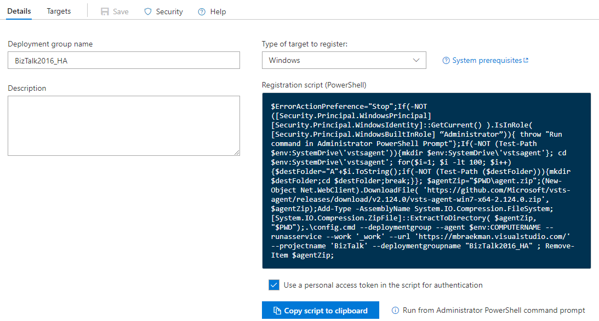
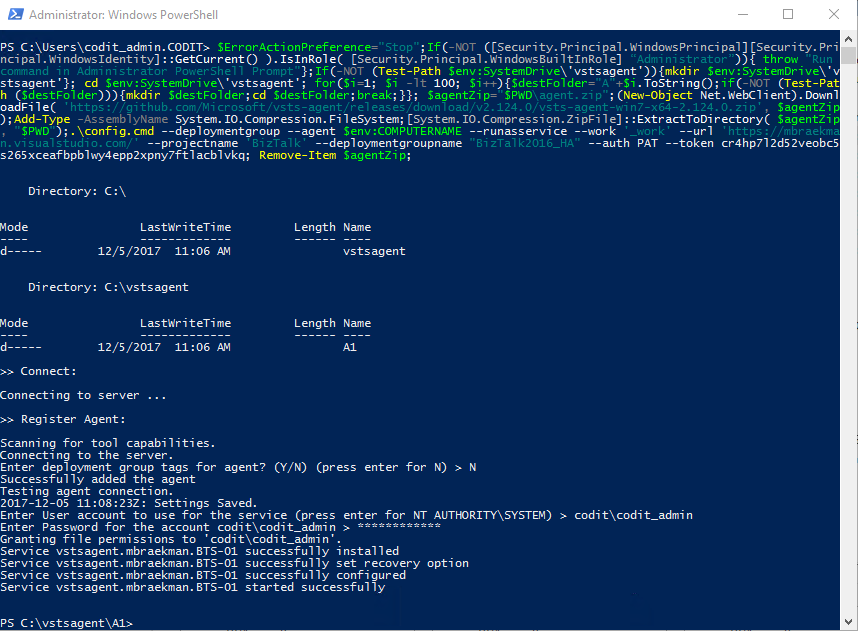
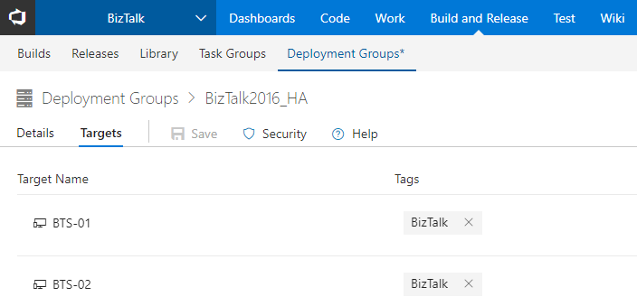
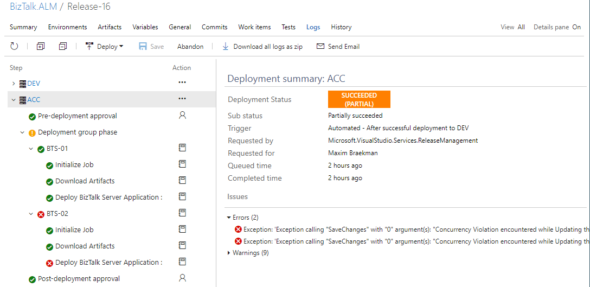
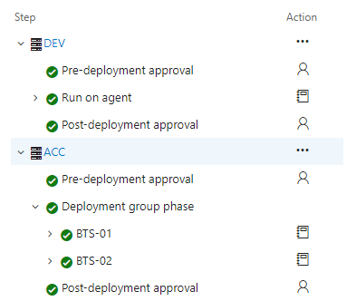

## BTS 2016 Feature Pack 2: Continuous Multi-Server Deployment

> Quite some time ago, the second edition of the BizTalk Server 2016 Feature Pack was released by Microsoft. One of the additions is the extension of the ALM-capabilities of the first pack, allowing automated multi-server deployment from VSTS. 

---

After the release of Feature Pack I, a blog-post about setting up automated deployment for a single BTS 2016 environment has been written by [Toon Vanhoutte](https://github.com/ToonVanhoutte), and can be found [here](https://www.codit.eu/blog/2017/05/02/bts-2016-feature-pack-i-continuous-deployment-walkthrough/). As he already did a perfect job on explaining how to set up the build and release steps and how to configure the BizTalk-solution itself, this will not be repeated over here. This post merely is going to walk you through the steps required to support a multi-server deployment.

Starting off with 1 of the differences, being that instead of assigning a single agent queue to a release definition, a multi-server deployment, will require multiple agents, as every server will need to have it installed in order to get the necessary deployment package. Compared to the process that was involved to get the agent installed on a single server, there is no need to create an actual agent queue in VSTS. In this case, the creation of a deployment group will provide you with the required PowerShell-script to get an agent installed onto the BizTalk-servers, without you having to take care of any PAT (Personal Access Token).

### Create a new Deployment Group

But what exactly is a deployment group?  Well, a deployment group is a logical set of deployment target machines, that each have an agent installed. So instead of creating a single agent queue, a deployment group provides you with the necessary PowerShell-script, that allows you to install an agent onto the servers onto which you want to have the BizTalk application installed. 

When navigating to **Deployment Groups**-section underneath the **Build and Release** tab in VSTS, you can very easily add a new group by clicking the 'New'-button and simply assigning a name to the group.


As soon as a name has been assigned and the group has been created, a PowerShell-script will be generated, allowing you to install the required agent onto whatever server you want to add.



### Install Local Build Agent

Once the PowerShell-script has been copied, connect to every BizTalk Server you want to add to the deployment group and open up a PowerShell-command prompt in Administrator mode and execute the script. You'll be asked if you want to add some tags, which can still be done at a later stage via VSTS, and to specify the service-account credentials.
That's it! No other actions are required to get an agent up and running.



After you have executed the script on every target server, return to VSTS and navigate to the deployment group. You'll notice that those servers have appeared in the **Targets** tab, along with a list of tags that might have been added to every single agent. These tags will allow you to make a difference between server located in the same group or just add some useful information for the release manager.



### Create/Extend a release definition

Previously, when creating a new environment in a release definition, you had to make sure the 'Run on agent'-step was chosen in order to have the pre-installed agent do the work defined in these steps. Now however, since a deployment group has been defined, this will have to be modified in order to inform the release definition which specific group needs to be used.  

By doing so, you'll notice there is 'Deployment group phase'-step, underneath all the same types of actions can be defined, but which will be referring to the earlier created deployment group. A big advantage of these groups is that it offers you the possibility to specify tags to every single target machine. In turn, this allows you to create a single group, but for instance only deploy to a couple of its target-servers, because for some reason, those other servers are not running that specific interface.


Something else to keep in mind is that, when it comes to multi-BizTalk server deployments, you need to make sure to select the '**One target at a time**' option, underneath the 'Targets to deploy to in parallel'-functionality.   
In doing so, this ensures that a deployment to the next machine is only being triggered, if a previous target machine has successfully been updated. If you were to select the 'Multiple'-option, you'll notice the deployments will fail, due to a concurrency-violation on the BizTalk application which is being updated, as can be seen below.

```
    ##[error]Exception: 'Exception calling "SaveChanges" with "0" argument(s): "Concurrency Violation encountered while Updating the SendPort 'spo_BizTalk.ALM_FILE'. The local, cached version of the BizTalk Server group configuration is out of date. You must refresh the BizTalk Server group configuration before making further changes."'
```



What the above exception shows us, is that all deployments to every single target-machine are considered as a full deployment, meaning the current application will be removed + reinstalled. So there is no full deployment on the first server, while the others are only getting a GAC-update. While this is not ideal, it does the trick though.  

### Test continuous deployment
If we trigger a release, in which both servers are being updated one at a time, we get to see a perfectly working release procedure, which is automatically updating the included assemblies and bindings. This functionality combined with the correct triggers/approvals will result into a great automated deployment procedure, allowing you to perfectly follow-up on any release.



### Conclusion
Thanks to the second Feature Pack for BizTalk Server 2016, we now have the built-in capability to deploy a solution onto a multi-server environment. While this does require you to make use of VSTS, it is a big step in the good direction.  
And you have to admit, installing/configuring the agents couldn't have been made any easier.

---

[&larr; back](index.md)
